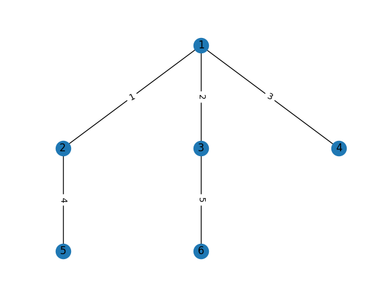

## Competitive-Programming visualizer

简单的画一下图咯

使用 `networkx` 理论上你能用 `matplotlib` 就能用这个，普通的图用 `planar_layout`，树的话自己糊了一下，具体看效果图。

根据样例 选一下格式，输入的数据在指定的文本文件里面

效果：

```sh
$ cat ./in.txt
6
1 2 1
1 3 2
1 4 3
2 5 4
3 6 5
$ ./interactive.py
Greetings, choose an input type (default: 0)

0(matrix):     1(edges):     2(number matrix):     3(edges with weight)
011            3 2           0 1 2                 3 2
101            1 2           1 0 2                 1 2 1
110            2 3           2 0 1                 2 3 2

4(tree):       5(tree w):    6(tree with f):
3              3             3
1 2            1 2 1         0 1 2
2 3            2 3 2

5

Is the graph directed? (default: no) [y/n]


Where is the input file? (default: ./in.txt)


```

